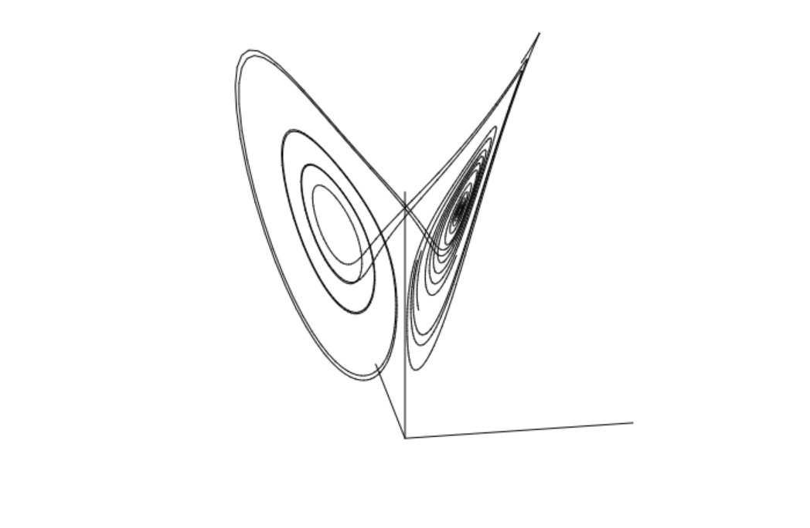
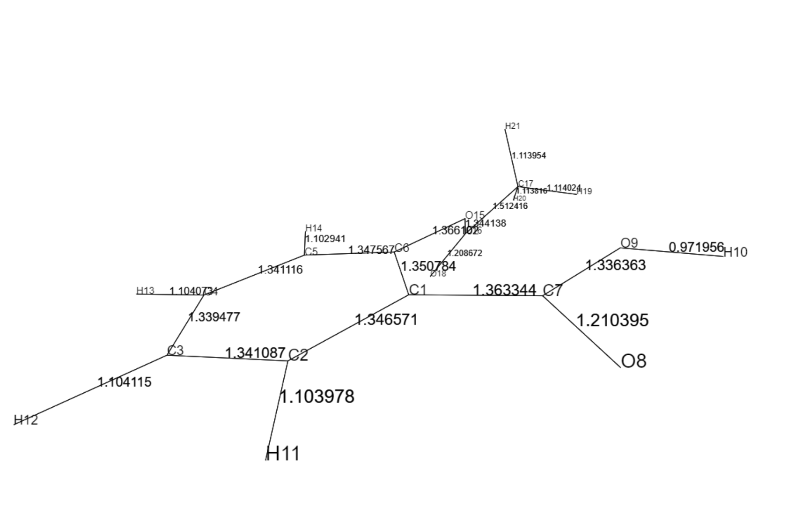
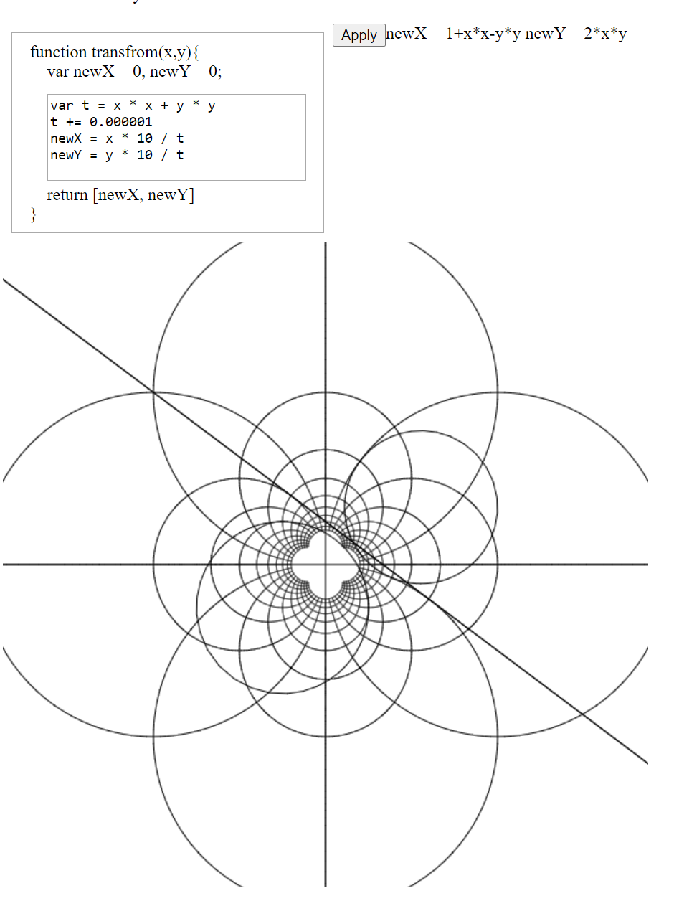
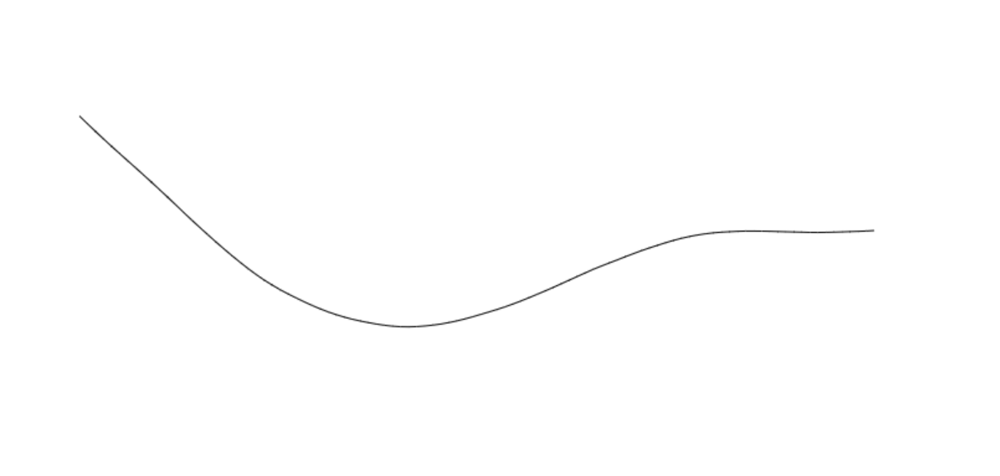

# visualizeJS
## Modules
### vecalc.js
- module for vector calculation
### 3dlib.js
- module for 3D projection
- requires vecalc.js
### graph.js
- module for 2D and 3D graph rendering
- requires above modules
## Some examples

### [diffEqRender](https://unknownpgr.github.io/js-visualization/diffEqRender.html) / [multiParticle](https://unknownpgr.github.io/js-visualization/multiParticle.html)

### [molRender](https://unknownpgr.github.io/js-visualization/molRender.html)

### [SpaceWrap](https://unknownpgr.github.io/js-visualization/spaceWrap.html)

### [String](https://unknownpgr.github.io/js-visualization/string.html)

