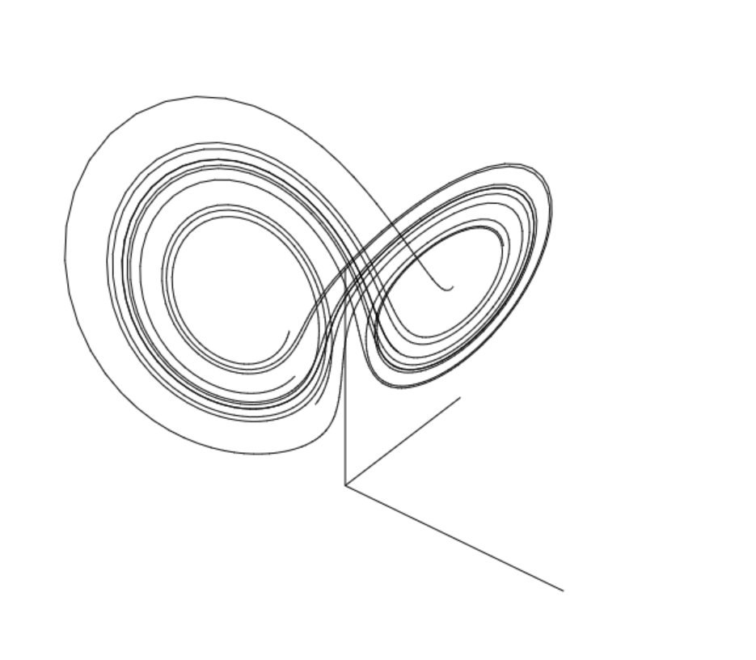
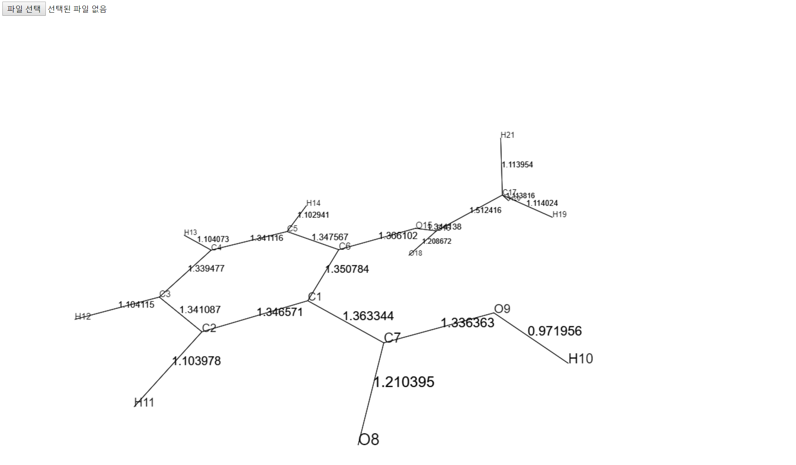

# visualizeJS
## Modules
### vecalc.js
- module for vector calculation
### 3dlib.js
- module for 3D projection
- requires vecalc.js
### graph.js
- module for 2D and 3D graph rendering
- requires above modules
## Some examples
### diffEqRender / multiParticle

### molRender
